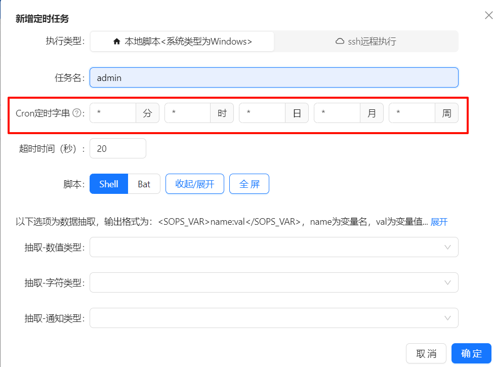
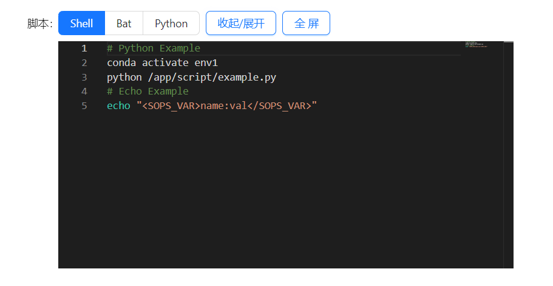
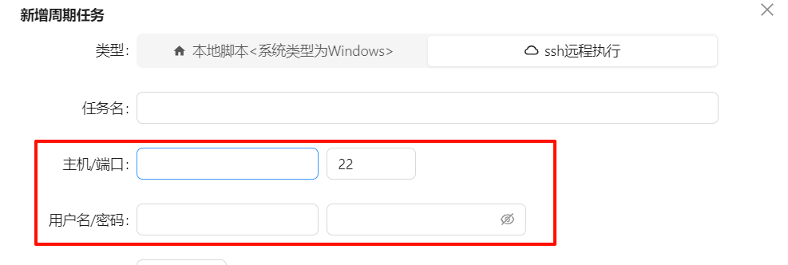
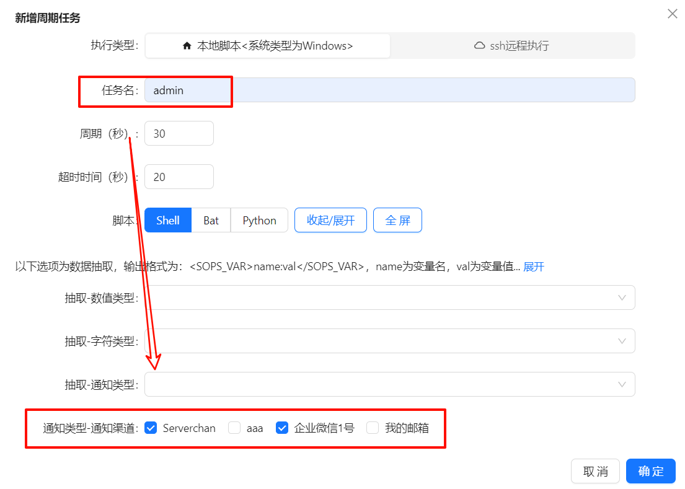
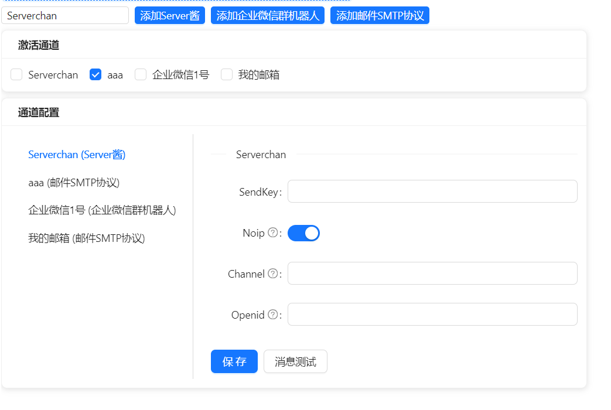
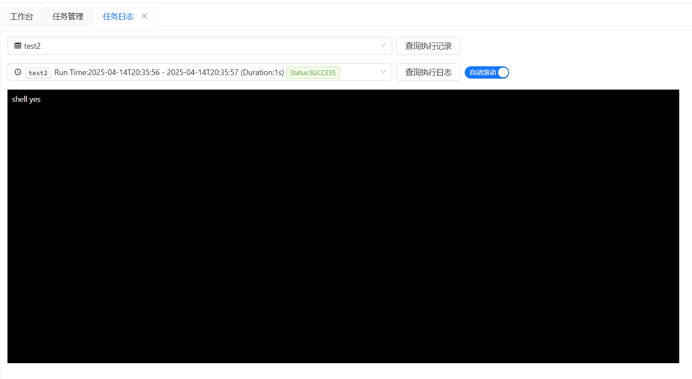

# 任务中心模块

### 1、 任务类别

支持`周期任务`和`定时任务`两种形式的作业

- **周期任务**

  周期任务以秒为单位的周期执行作业

  

- **定时任务**

  以类Linux的Cron字串规定执行时间的定时作业

  > 参考链接https://www.runoob.com/w3cnote/linux-crontab-tasks.html
  >
  > 分：minute: minute (0-59)
  >
  > 时：hour: hour (0-23)
  >
  > 日：day: day of month (1-31)
  >
  > 月：month: month (1-12)
  >
  > 周：day_of_week: number or name of weekday (0-6 or mon,tue,wed,thu,fri,sat,sun)

  

### 2、 任务脚本

- **Shell脚本**

支持shell脚本执行（内部调用指令为sh，linux无需配置，如app_scheduler.py机器是在windows上执行的，则需要安装msys2/git bash等，然后添加到PATH环境变量中）

- **Bat脚本**

> 支持bat脚本执行（内部调用指令为：cmd /c，需要为windows系统才可执行）

- **Python脚本**

  

### 3、 支持本地脚本/ssh远程连接

- **本地脚本**
- **ssh远程执行**

> ssh需要填写额外的远程主机信息，包括主机、ssh端口、用户名和密码，如配置免密，无需填写密码

  

### 4、数据采集 与 消息推送

实现数据的收集，用于数据大屏、数据监控等目的

抽取类型分为`数值型`和`字符串型`

比如有一个名为`cpu_load`的数值型抽取需求，则对应日志输出需要包含以下内容：

```
<SOPS_VAR>cpu_load:99.1</SOPS_VAR>
```

任务模块会将99.1保存至数据库的`sys_apscheduler_extract_value`表中

> 1、符合格式要求的数值类型/字符类型，会写入数据库sys_apscheduler_extract_value表中； 
>
> 2、符合格式要求的通知类型，会把name当作标题，val为内容，通过配置的“系统设置/通知接口”发送出去。[Server酱购买渠道](https://sct.ftqq.com/r/16293)
>
> #### 每个任务可以独立绑定通知渠道，可以定义个性化的消息通知服务
>
> 


### 5、支持Server酱、企业微信群机器人、邮箱多种通知渠道

>
> 

### 6、 实时日志查看

1. 选择对应的任务名，点击查询

2. 选择需要查看的执行记录，点击查询，即可打印出日志

  

> 对于正在运行的日志，支持实时日志查看哦